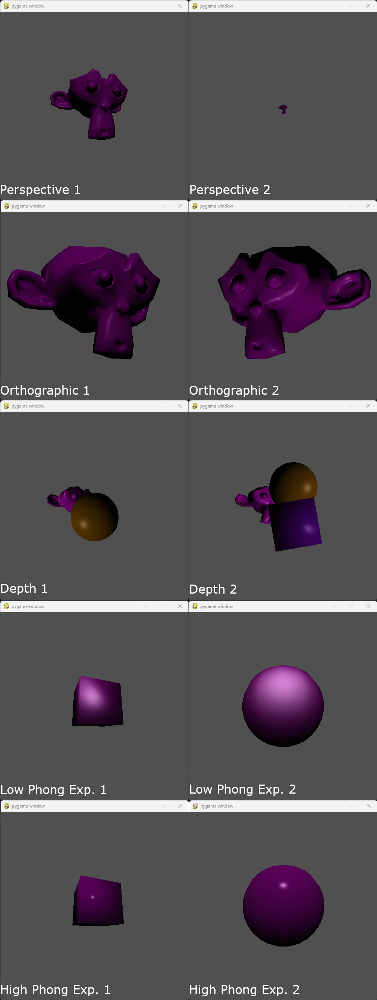
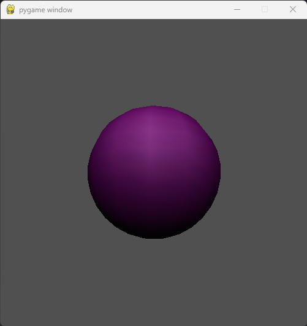

# Programming Assignment 7

Class: CS 4204 (Computer Graphics), Fall 2023

Professor: Brendan David-John

## Overview

In this programming assignment, you are going to complete the seventh step needed to render a 3D mesh, smooth shading! 
You will be extending the render loop in `Renderer` to compute `phong` shading, which requires modifying the `Mesh` 
class to calculate vertex normals. The render loop will also incorporate specular shading into the Lambertian 
reflection equation.

## Instructions
The render loop function signature will not change for this assignment. However, a new render mode will be added: 
"phong". When "phong" is passed as the first argument to the render method, the renderer will produce a smooth 
shaded image where the normal vector used in the lighting calculations is interpolated from the face's vertex normals. Specifically, the Blinn-Phong method should be implemented, in which the half vector H is used to compute the specular lighting component, instead of the Reflection vector R. 

As with `flat` shading, `phong` shading should make use of the normal direction to cull back faces of each mesh. The depth value after projection should be used for depth clipping, by only rendering surface points that are within the bounds of -1 and 1, i.e., between the near and far planes. You must also maintain a z-buffer by keeping track of the depth value after projection. The depth value should be interpolated along each fragment using barycentric coordinates and is used to check whether the current surface is occluded by a closer object or not. Your depth buffer should be initialized to the same size as the screen with values of negative infinity or some large negative number. You should skip rendering surface points where the z values are less than what is currently stored in the buffer for our coordinate system.

In addition, you should add the specular shading component to the lighting calculations, making use of the specular 
coefficient and specular color values present in the `Mesh` class.

This assignment will make use of visual checks to validate your solutions.

### Output

There are a total of 8 scripts that can be executed. `extracredit.py` is what will be run to evaluate the extra 
credit. The scripts are: `assignment7_perspective_1`, `assignment7_perspective_2`, `assignment7_ortho_1`, 
`assignment7_ortho_2`, `assignment7_depth_1`, `assignment7_depth_2`, `assignment7_highphongexp_1`, 
`assignment7_highphongexp_2`, `assignment7_lowphongexp_1`, and `assignment7_lowphongexp_2`. The following image is 
a collage of running all of them:



The scenes vary camera, mesh, and light position parameters and in some files include multiple objects with different depth orderings.

Note that these scripts require that the `PointLight` class has a `Transform` object (that defaults to no 
rotation or translation) member used to set the position and rotation of the light source.

### Dependency Management
Each assignment will include a requirements.txt file that includes the python package requirements for the assignment. If you are using PyCharm it should automatically detect and install the dependencies when you create the virtual environment. Otherwise, [these instructions](https://www.jetbrains.com/help/pycharm/managing-dependencies.html#configure-requirements) will help you manually manage the requirements in PyCharm. If you are using something other than PyCharm, you can use the command line to manually install the packages from the requirements.txt file:

```bash
pip install -r requirements.txt
```

## Updates to the `Mesh` class

### Exposed Members

#### `vertex_normals`
In order to smoothly interpolate between vertex normals, we need to compute the vertex normals when the mesh is 
instantiated. For each vertex, identify all faces that use that vertex, and calculate the average of their normals. 
This average normal will be the vertex normal. Note that the indexing of `vertex_normals` and `verts` should be the 
same, that is that the vertex normal at `vertex_normals[i]` should be the vertex normal for the vertex at `verts[i]`.

## Update to the `Renderer` class

### Updated Methods

#### `render(self, shading, bg_color, ambient_light)`
The method signature remains unmodified. However, a new valid method of shading, `phong`, should be introduced. 
That is, when the string "phong" is passed in as the `shading` parameter, the output image should be shaded using 
the (Blinn-) Phong method.

*Hint: make sure that the vertex normals are converted to the correct coordinate space before doing the normal 
vector interpolation.*

## Extra Credit
Extra credit for this assignment will be to add a `gouraud` shading mode. Recall that the difference between flat, 
Gauraud, and Phong shading is what values are interpolated for each fragment. Flat shading does not interpolate any 
values, and Phong shading interpolates the vertex normals. Gouraud shading calculates color values for each vertex 
before the fragment stage, and then interpolates these colors during the fragment stage. This still provides a smooth 
shading result, at a much lower computational cost compared to Phong shading, but can result in specular shading 
artifacts. Specifically, Gouraud shading tends to provide a noticeable difference in the specular highlights on the 
mesh edges compared to the faces. The extra credit will be validated by running `extracredit.py` and comparing the 
resulting rendering with the expected output below.





## Rubric
There are 20 points (22 with extra credit) for this assignment:
- *20 pts*: The Phong shaded renderings produced from the assignment7_* scripts are rendered as expected.
  - *2 pts*: `assignment7_perspective_1`
  - *2 pts*: `assignment7_perspective_2`
  - *2 pts*: `assignment7_ortho_1`
  - *2 pts*: `assignment7_ortho_2`
  - *2 pts*: `assignment7_depth_1`
  - *2 pts*: `assignment7_depth_2`
  - *2 pts*: `assignment7_lowphongexp_1`
  - *2 pts*: `assignment7_lowphongexp_2`
  - *2 pts*: `assignment7_highphongexp_1`
  - *2 pts*: `assignment7_highphongexp_2`

